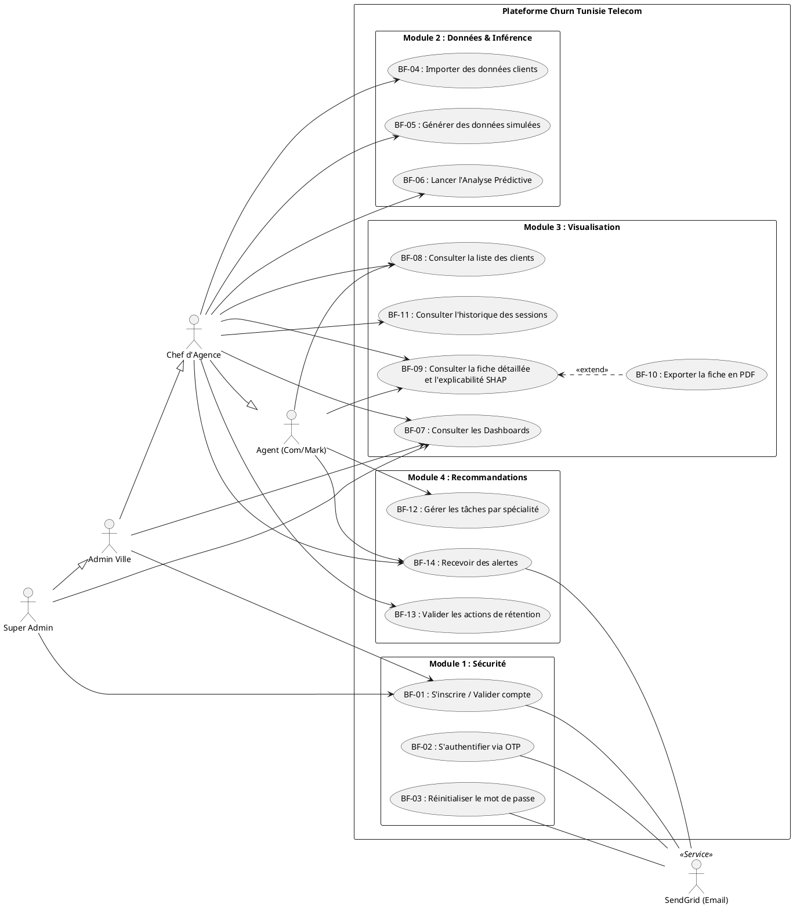
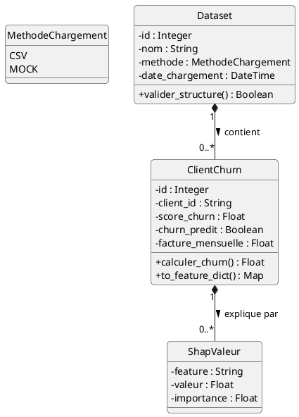
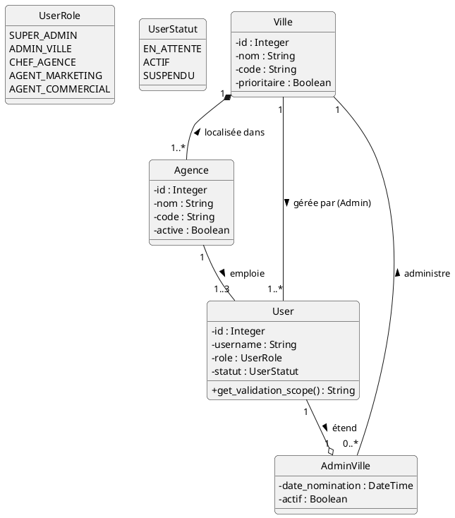
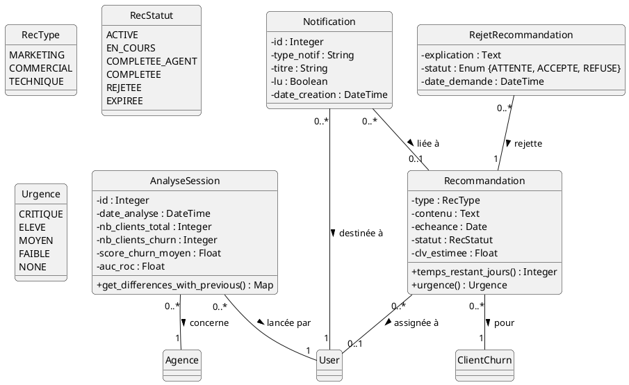
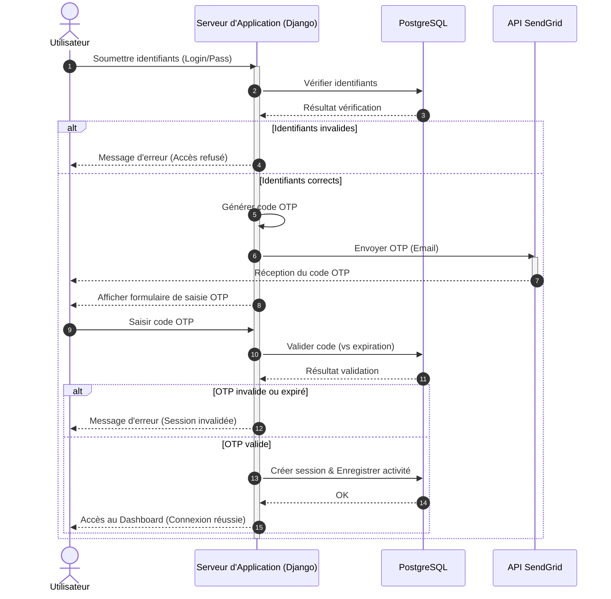
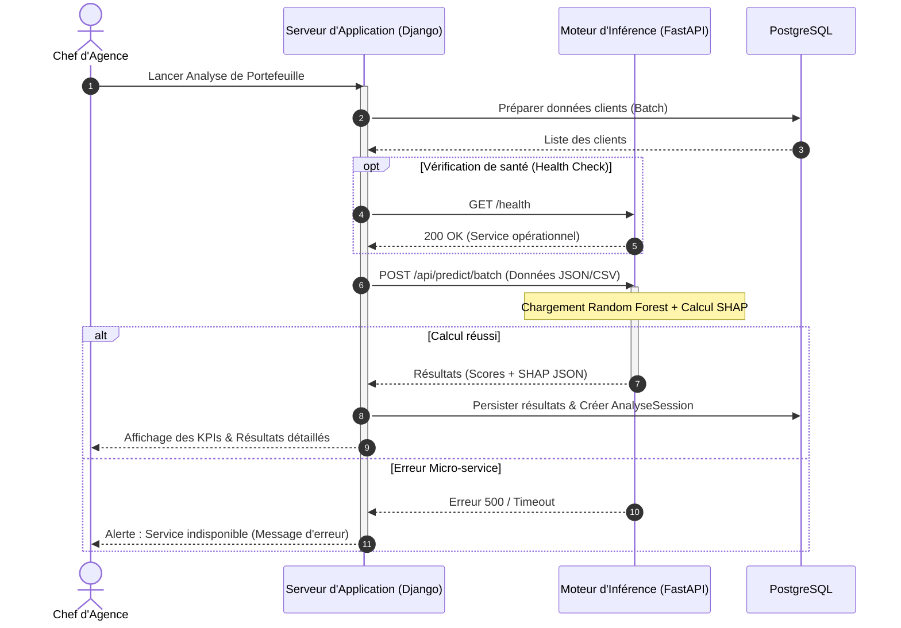
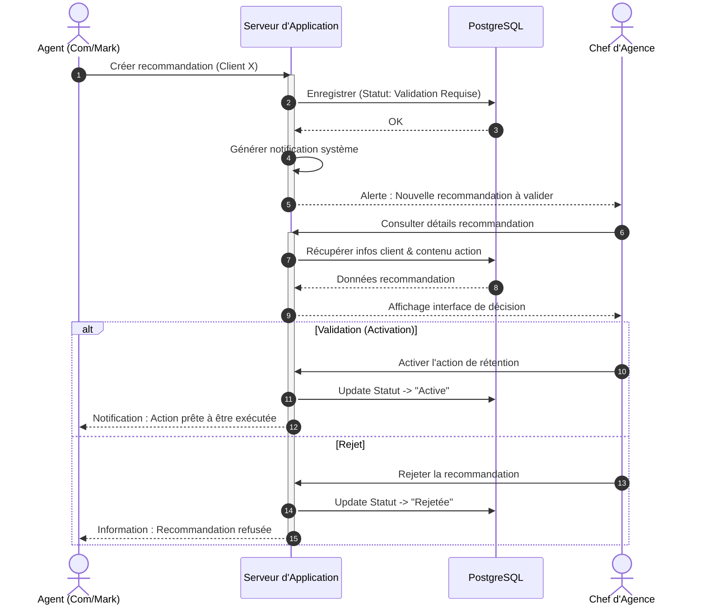
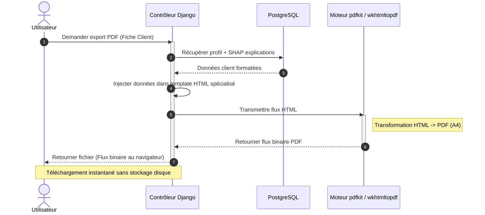

# Guide de Modélisation UML — Projet CHURN (Tunisie Telecom)

Ce document constitue la référence officielle pour la modélisation du système. Il respecte les normes académiques UML et couvre l'intégralité des 14 Besoins Fonctionnels (BF) validés.

---

## 1. Principes de Conception et Conventions

- **Standardisation :** Notation UML 2.5 rigoureuse.
- **Traçabilité :** Chaque cas d'utilisation est lié à son identifiant de besoin (BF-XX).
- **Acteurs :** Les actions système (ex: calculs) ne sont pas des Use Cases. Seuls les objectifs acteurs sont représentés.

---

## 2. Chapitre 2 : Analyse et Conception

### 2.1 Liste des Besoins Fonctionnels (Référence)
- **M1 (Sécurité) :** BF-01 (Inscription), BF-02 (2FA), BF-03 (Reset MDP).
- **M2 (Données) :** BF-04 (Import), BF-05 (Mock), BF-06 (Analyse Prédictive IA).
- **M3 (Pilotage) :** BF-07 (Dashboards G/R/A), BF-08 (Liste Clients), BF-09 (Fiche Détail/SHAP), BF-10 (Export PDF), BF-11 (Historique Sessions).
- **M4 (Actions) :** BF-12 (Tâches Agents), BF-13 (Validation Chef), BF-14 (Alertes).

### 2.2 Diagramme de Cas d'Utilisation Global (Conventionnel)

### 2.3 Diagramme de Classes : Modèle de Données (Learning)

### 2.4 Diagramme de Classes : Organisation & Sécurité (Core & Accounts)

### 2.5 Diagramme de Classes : Pilotage & Actions (Dashboard)

---

## Chapitre 6 : Diagrammes de Séquence

Nous utilisons les diagrammes de séquence pour modéliser les interactions dynamiques entre les composants de notre architecture. Ces schémas illustrent comment les différents services (Serveur d'Application, Moteur d'Inférence ML, PostgreSQL, SendGrid) collaborent pour réaliser les processus métier critiques.

### 6.1 Flux 1 : Authentification à double facteur (2FA)

Ce processus sécurise l'accès à la plateforme en générant un code OTP via SendGrid après la validation des identifiants primaires.

### 6.2 Flux 2 : Analyse de portefeuille avec FastAPI

Ce flux constitue le cœur technologique, intégrant une communication asynchrone avec le moteur d'inférence ML.

### 6.3 Flux 3 : Workflow de recommandation et validation

Modélisation du cycle de vie des actions de rétention reflétant l'organisation hiérarchique de Tunisie Telecom.

### 6.4 Flux 4 : Exportation de rapports PDF

Génération de documents à la volée en transformant le rendu HTML (avec SHAP) en PDF via wkhtmltopdf.

