## 1) Diagramme de cas d'utilisation global (détaillé)

```mermaid
usecaseDiagram
    %% Acteurs (figurines)
    actor SuperAdmin as Super
    actor AdminVille as AdminVille
    actor ChefAgence as Chef
    actor AgentCommercial as AgentCom
    actor AgentMarketing as AgentMark

    %% Cas d'utilisation
    (Se connecter / OTP) as UC_Auth
    (Se déconnecter) as UC_Logout
    (Gérer comptes utilisateurs) as UC_GererCompte
    (Consulter fiche client) as UC_ConsulterClient
    (Consulter historique recommandations) as UC_HistoriqueReco
    (Lancer analyse / import) as UC_LancerAnalyse
    (Générer données mock) as UC_GenererMock
    (Créer recommandation commerciale) as UC_CreerRecoCom
    (Créer recommandation marketing) as UC_CreerRecoMark
    (Valider / Rejeter recommandation) as UC_ValiderReco
    (Compléter recommandation) as UC_CompleterReco
    (Consulter notifications) as UC_ConsulterNotif
    (Accéder tableau de bord KPIs) as UC_Dashboard
    (Accéder tableau de bord multi-agences) as UC_DashboardMulti

    %% Liens acteur → use case
    AgentCom --> UC_Auth
    AgentCom --> UC_Logout
    AgentCom --> UC_ConsulterClient
    AgentCom --> UC_HistoriqueReco
    AgentCom --> UC_CreerRecoCom
    AgentCom --> UC_CompleterReco
    AgentCom --> UC_ConsulterNotif

    AgentMark --> UC_Auth
    AgentMark --> UC_Logout
    AgentMark --> UC_ConsulterClient
    AgentMark --> UC_HistoriqueReco
    AgentMark --> UC_CreerRecoMark
    AgentMark --> UC_CompleterReco
    AgentMark --> UC_ConsulterNotif

    Chef --> UC_Auth
    Chef --> UC_Logout
    Chef --> UC_ConsulterClient
    Chef --> UC_HistoriqueReco
    Chef --> UC_LancerAnalyse
    Chef --> UC_GenererMock
    Chef --> UC_ValiderReco
    Chef --> UC_ConsulterNotif
    Chef --> UC_Dashboard

    AdminVille --> UC_Auth
    AdminVille --> UC_Logout
    AdminVille --> UC_GererCompte
    AdminVille --> UC_DashboardMulti

    Super --> UC_Auth
    Super --> UC_Logout
    Super --> UC_GererCompte
    Super --> UC_DashboardMulti

    %% Héritage / spécialisation des rôles (visualisation)
    Super --|> AdminVille
    AdminVille --|> Chef

    %% Intégrations techniques (références)
    UC_LancerAnalyse ..> FastAPI : "POST /api/predict/batch"
    UC_ConsulterClient ..> FastAPI : "GET /api/predict/{id}"
    UC_ExporterPDF ..> WKHTML : "wkhtmltopdf"
    %% Note : le diagramme utilise la notation usecaseDiagram pour afficher
    %% les figurines d'acteurs et la hiérarchie simple des rôles.
```

---

## 2) Diagramme Entité-Association (E-A) — Plus complet

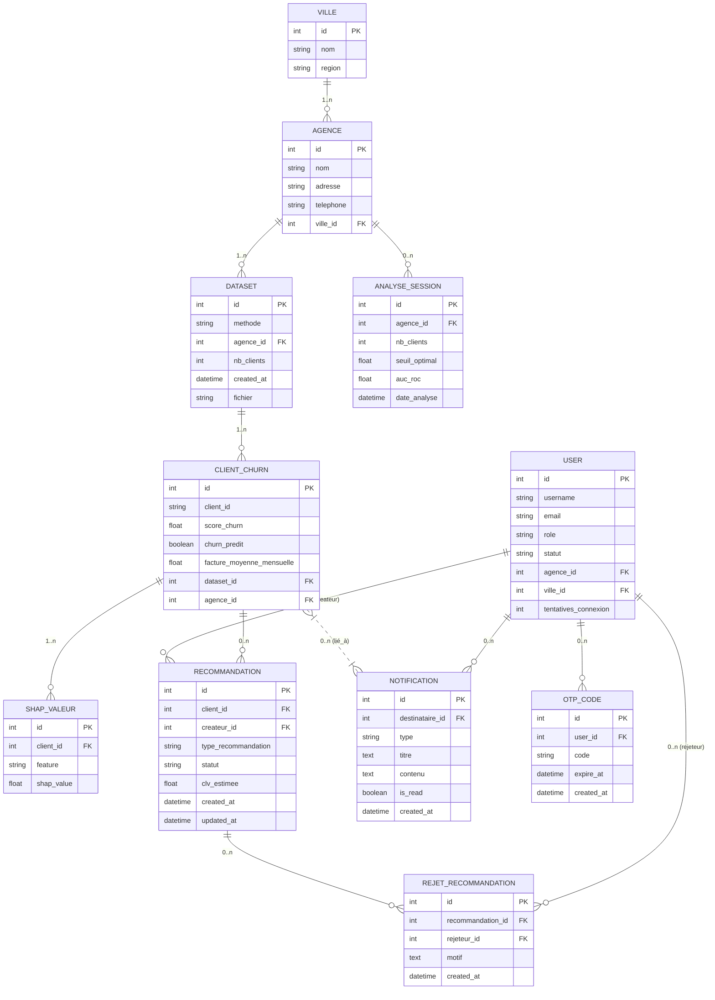

---

## 3) Diagrammes de classes par module

### 3.1 Module `accounts`

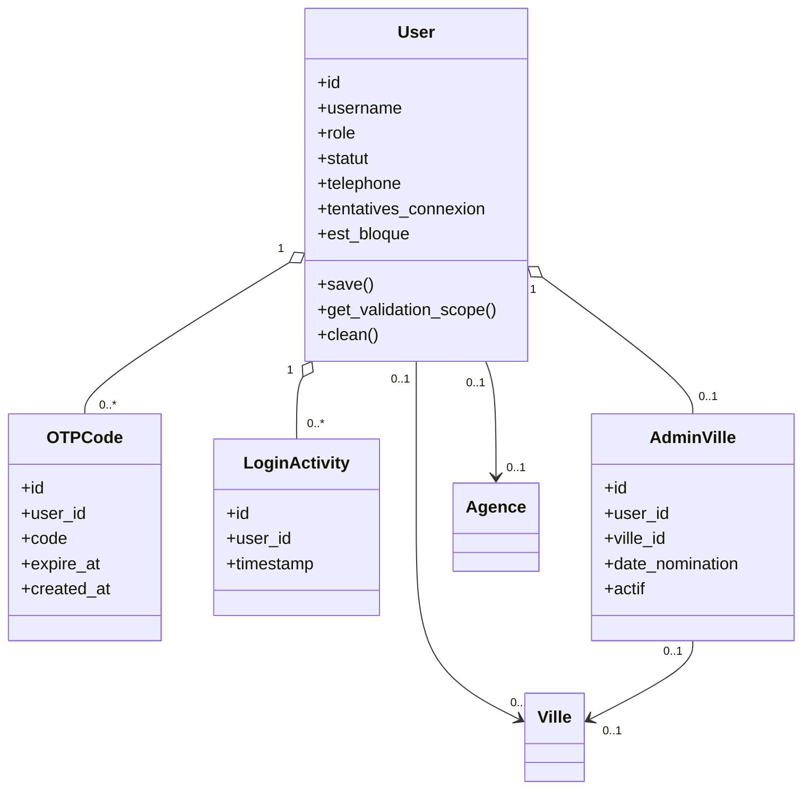

### 3.2 Module `learning`

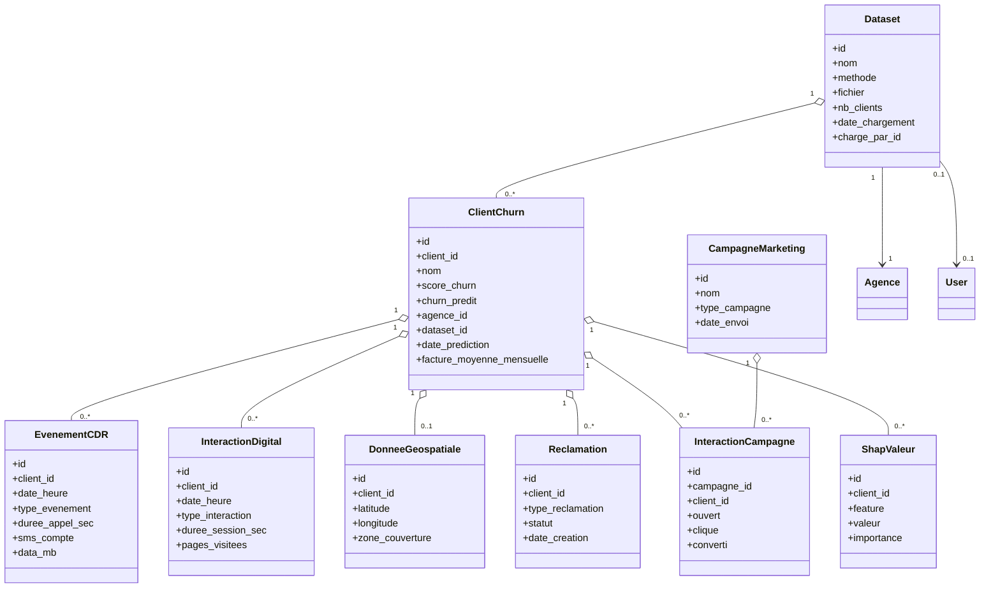

### 3.3 Module `dashboard`

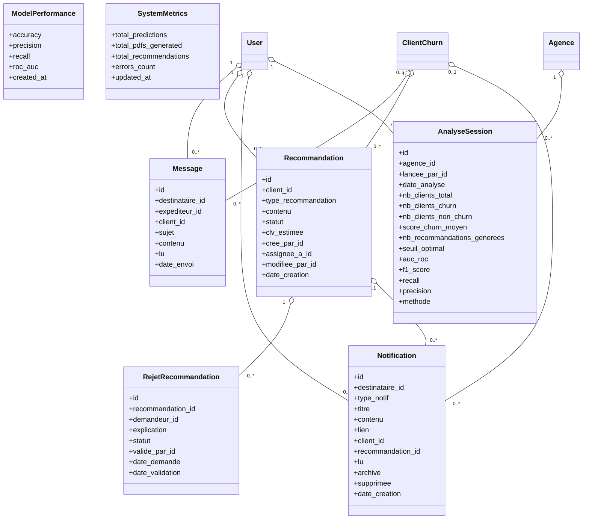

---

## 4) Diagrammes de séquence — Flux clés

### 4.1 Flux : Authentification à double facteur

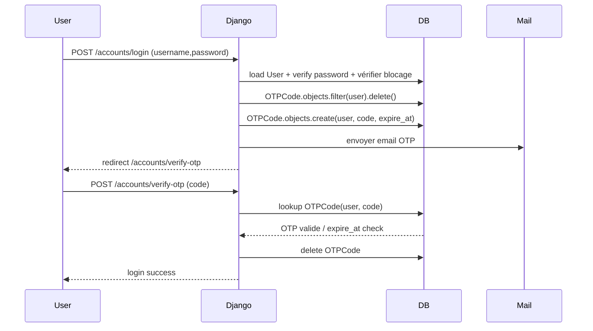

### 4.2 Flux : Lancer analyse (FastAPI disponible — batch)

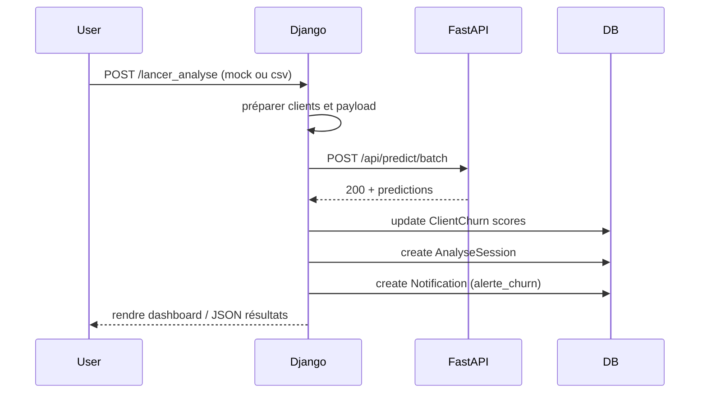

### 4.3 Flux : Lancer analyse (FastAPI indisponible — comportement réel)

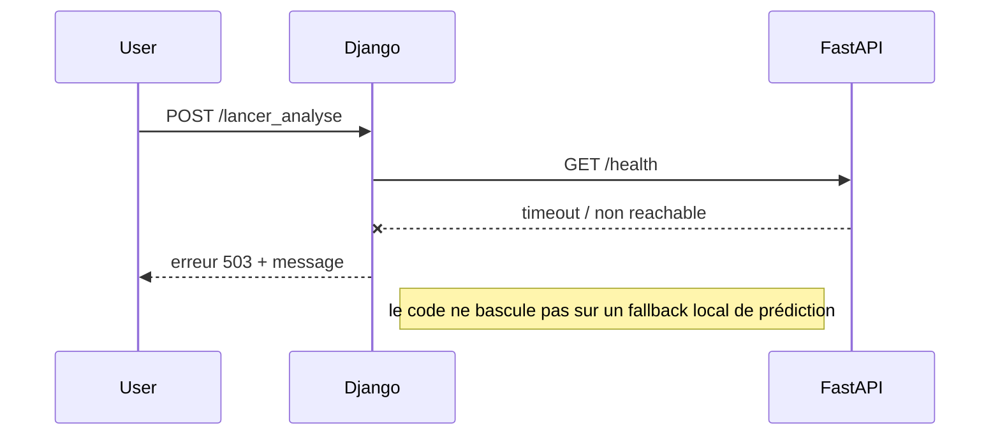

### 4.4 Flux : Génération de données mock

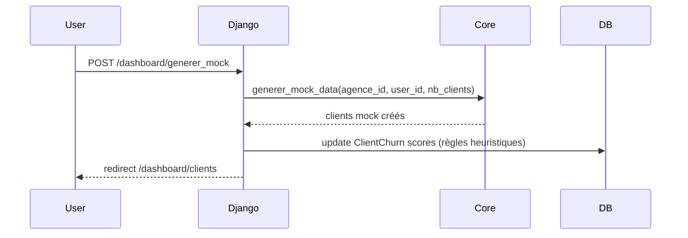

### 4.5 Flux : Workflow de recommandation (création → validation → rejet)

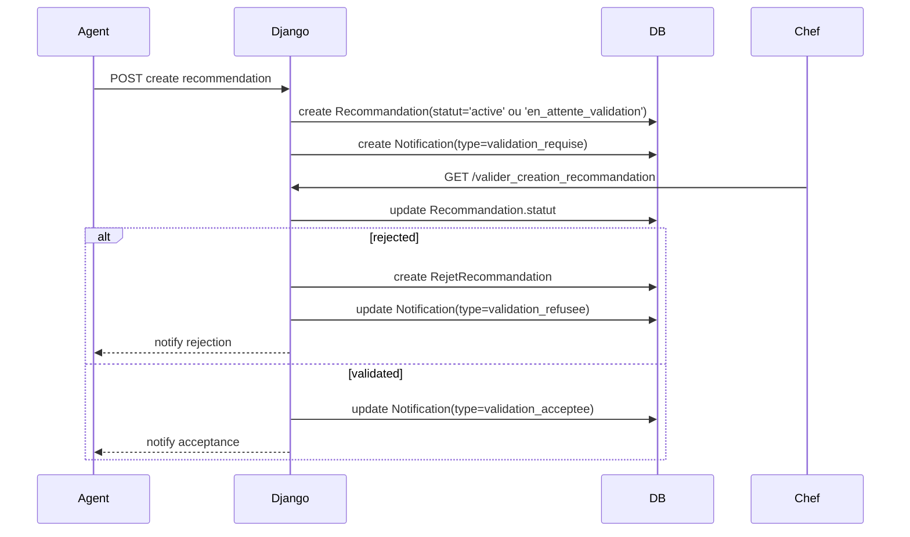

### 4.6 Flux : Export PDF depuis la fiche client via wkhtmltopdf

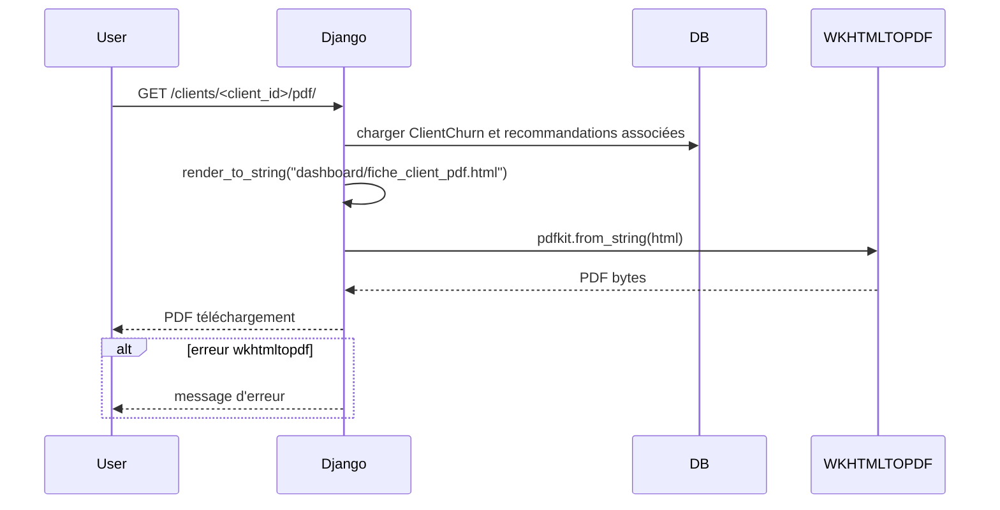

---

## 5) Arborescence UML — Structure des modules

```mermaid
graph TD
    A["Projet CHURN"] --> B[" accounts"] 
    A --> C[" learning"]
    A --> D["dashboard"]
    A --> E["core"]
    A --> F["config"]
    
    B --> B1["User modèle custom"]
    B --> B2["OTPCode"]
    B --> B3["AdminVille"]
    B --> B4["LoginActivity"]
    B --> B5["Views login verify-otp reset"]
    B --> B6["Forms AuthForm ResetForm"]
    B --> B7["Services email OTP"]
    
    C --> C1["Dataset"]
    C --> C2["ClientChurn"]
    C --> C3["ShapValeur"]
    C --> C4["EvenementCDR"]
    C --> C5["InteractionDigital"]
    C --> C6["DonneeGeospatiale"]
    C --> C7["Pipeline ML Data Quality"]
    
    D --> D1["Recommandation"]
    D --> D2["RejetRecommandation"]
    D --> D3["Notification"]
    D --> D4["AnalyseSession"]
    D --> D5["Message"]
    D --> D6["Tasks Celery async"]
    D --> D7["Views dashboard validation"]
    
    E --> E1["ml_service prédictions"]
    E --> E2["ml_pipeline prétraitement"]
    E --> E3["fastapi_service intégration"]
    E --> E4["data_quality nettoyage"]
    E --> E5["model_config hyperparamètres"]
    E --> E6["notifications_engine"]
    E --> E7["otp_service"]
    E --> E8["mock_data génération test"]
    
    F --> F1["settings.py Django config"]
    F --> F2["urls.py routing"]
    F --> F3["wsgi.py"]
    F --> F4["asgi.py"]
```

---

## 6) Arborescence URL — Structure du routage

```mermaid
graph TD
    Root["/ ROOT"] --> Auth[" /accounts/"]
    Root --> Dashboard["/dashboard/"]
    Root --> Admin[" /admin/"]
    Root --> API[" /api/"]
    
    Auth --> A1["login GET/POST"]
    Auth --> A2["verify-otp GET/POST"]
    Auth --> A3["logout GET"]
    Auth --> A4["reset-password GET/POST"]
    Auth --> A5["gestion-comptes GET/POST"]
    Auth --> A6["create-user GET/POST"]
    Auth --> A7["edit-user/:id GET/POST"]
    Auth --> A8["delete-user/:id POST"]
    
    Dashboard --> D1["clients/ GET"]
    Dashboard --> D2["clients/:id/ GET"]
    Dashboard --> D3["clients/:id/pdf/ GET"]
    Dashboard --> D4["recommandations/ GET/POST"]
    Dashboard --> D5["recommandations/:id/valider/ POST"]
    Dashboard --> D6["recommandations/:id/rejeter/ POST"]
    Dashboard --> D7["notifications/ GET"]
    Dashboard --> D8["notifications/:id/marquer-lu/ POST"]
    Dashboard --> D9["analyse/ GET/POST"]
    Dashboard --> D10["generer-mock/ POST"]
    Dashboard --> D11["statistiques/ GET"]
    
    Admin --> Adm1["Django Admin Interface"]
    
    API --> AP1["health GET"]
    API --> AP2["model-info GET"]
    AP2 --> AP2a["FastAPI: /api/model/info"]
    AP1 --> AP1a["FastAPI: /health"]
```


