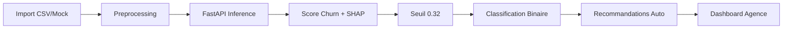

# Présentation de Soutenance — Projet CHURN Tunisie Telecom

---

## Structure de la Présentation (20-25 minutes)

---

## 1. Introduction (2 minutes)

### Contexte
- **Problème business** : Le churn client représente un coût majeur pour les opérateurs télécoms
- **Enjeu Tunisie Telecom** : Optimiser la rétention client à l'échelle des agences
- **Solution proposée** : Plateforme de prédiction et gestion du churn avec workflow de validation hiérarchique

### Objectifs du projet
- Détection précoce des clients à risque de churn
- Génération automatique de recommandations d'action
- Workflow de validation hiérarchique (Chef d'Agence → Agents)
- Tableaux de bord analytiques par agence

---

## 2. Architecture Technique (3 minutes)

### Stack Technologique
```
┌─────────────────────────────────────────────────────────┐
│                    Interface Web                        │
│              Django 4.2 + Bootstrap 5                   │
└─────────────────────────────────────────────────────────┘
                            ↓
┌─────────────────────────────────────────────────────────┐
│              Service de Prédiction ML                    │
│              FastAPI + XGBoost + SHAP                   │
└─────────────────────────────────────────────────────────┘
                            ↓
┌─────────────────────────────────────────────────────────┐
│                  Base de Données                        │
│                   PostgreSQL 14                         │
└─────────────────────────────────────────────────────────┘
```

### Points forts techniques
- **Architecture hybride** : Django pour le métier, FastAPI pour l'inférence ML
- **Séparation des responsabilités** : Interface web dissociée du moteur de prédiction
- **Scalabilité** : Service ML indépendant, évolutif
- **Explicabilité** : Intégration SHAP pour l'interprétation des prédictions

---

## 3. Partie DATA — Modélisation ML (8 minutes)

### 3.1 Pipeline de Prédiction

#### Features Utilisées (31 variables)
```python
# Catégorielles
- Type d'abonnement, Ville, Agence, Canal d'acquisition

# Numériques
- Facture mensuelle, Consommation data, Appels sortants
- Ancienneté, Nombre de réclamations, Retards paiement
- Score satisfaction, Usage services additionnels
```

#### Algorithme Principal : Random Forest
- **Modèle** : RandomForestClassifier (scikit-learn)
- **Performance** : AUC = 0.8954, F1 = 0.7797, Recall = 0.92
- **Seuil de décision** : 0.32 (optimisé sur validation set)

### 3.2 Métriques de Performance

| Métrique | Valeur | Interprétation |
|----------|--------|----------------|
| AUC-ROC | 0.8954 | Excellente capacité de discrimination |
| F1-Score | 0.7797 | Bon équilibre précision/rappel |
| Recall | 0.92 | Détection de 92% des churns réels |
| Precision | 0.68 | 68% des alertes sont vrais positifs |

### 3.3 Explicabilité avec SHAP

#### Pourquoi SHAP ?
- **Transparence** : Comprendre pourquoi un client est classé à risque
- **Confiance** : Les agents peuvent expliquer les décisions aux clients
- **Actionnabilité** : Identifier les leviers d'intervention prioritaires

#### Exemple d'explication locale
```
Client ID: CUST-001 | Score Churn: 0.78 (Risque Élevé)

Top Facteurs SHAP:
+0.15  Réclamations élevées (5 dernières 30j)
+0.12  Retard paiement > 15 jours
+0.08  Facture mensuelle > 200 DT
+0.05  Ancienneté < 6 mois
-0.10  Satisfaction élevée (4.5/5)
-0.05  Usage services premium
```

#### Interprétation globale
- **Features les plus impactantes** : Réclamations, Retards paiement, Facture mensuelle
- **Segmentation** : Les clients récents et insatisfaits sont les plus vulnérables

### 3.4 Workflow de Prédiction



### 3.5 Artefacts ML
- **Modèle sérialisé** : `churn_model_v1.pkl`
- **Metadata** : `churn_metadata_v1.json` (métriques, seuil, features)
- **Explainer SHAP** : `shap_explainer.pkl`
- **Matrice SHAP test set** : Pour comparaisons et benchmarking

---

## 4. Partie MÉTIER — Cas d'Usage Business (8 minutes)

### 4.1 Organisation et Rôles

#### Hiérarchie Tunisie Telecom
```
Super Admin (National)
    ↓
Admin Ville (Régional)
    ↓
Chef d'Agence (Local)
    ↓
Agents (Marketing / Commercial)
```

#### Droits et Responsabilités

| Rôle | Accès | Actions Principales |
|------|-------|---------------------|
| **Super Admin** | Global | Création villes, gestion tous comptes |
| **Admin Ville** | Sa ville | Gestion agences/users de sa ville |
| **Chef d'Agence** | Son agence | Lancer analyses, valider recommandations |
| **Agent Marketing** | Son agence | Gérer recommandations marketing |
| **Agent Commercial** | Son agence | Gérer recommandations commerciales |

### 4.2 Workflow Métier Complet

#### Étape 1 : Import des Données
- **Source** : Fichier CSV/Excel avec données clients
- **Champs requis** : ID client, facture, consommation, réclamations, etc.
- **Validation** : Vérification structure et cohérence

#### Étape 2 : Lancement de l'Analyse
- **Déclencheur** : Chef d'Agence via dashboard
- **Processus** : Appel API FastAPI pour scoring batch
- **Résultat** : Scores churn + SHAP pour tous les clients

#### Étape 3 : Génération de Recommandations
- **Moteur de règles** : `core/notifications_engine.py`
- **Types d'actions** :
  - **Marketing** : Offres promotionnelles, fidélisation
  - **Commercial** : Visites terrain, appels personnalisés
  - **Technique** : Résolution problèmes, amélioration service

#### Étape 4 : Attribution aux Agents
- **Routing automatique** : Marketing → Agent Marketing, Commercial → Agent Commercial
- **Priorisation** : CLV estimée + urgence
- **Notifications** : Alertes temps réel pour les agents

#### Étape 5 : Exécution et Validation
- **Agent** : Marque action comme terminée
- **Chef d'Agence** : Valide ou refuse la complétion
- **Traçabilité** : Historique complet des actions

### 4.3 Tableaux de Bord

#### Dashboard Global Agence
- **KPIs principaux** : Total clients, Taux churn, Churn/Non-churn
- **Top clients à risque** : Classement par score churn
- **Recommandations récentes** : Dernières actions générées
- **Explications SHAP** : Top facteurs par client

#### Historique des Analyses
- **Traçabilité temporelle** : Évolution du churn par session
- **Comparaison** : Différences entre analyses successives
- **Filtrage** : Par type (mock/réel) et période

#### Centre de Recommandations
- **Vue prioritaire** : Actions urgentes à traiter
- **Vue validation** : Actions en attente de validation chef
- **Vue historique** : Actions complétées/archivées

### 4.4 Cas d'Usage Concret

#### Scénario : Agence de Kairouan
1. **Import** : 300 clients du mois en cours
2. **Analyse** : 45 clients identifiés comme churn (score ≥ 0.32)
3. **Recommandations** : 81 actions générées automatiquement
4. **Distribution** : 
   - 30 actions marketing (offres fidélisation)
   - 40 actions commerciales (visites terrain)
   - 11 actions techniques (résolution problèmes)
5. **Exécution** : Agents traitent les actions selon priorité
6. **Résultat** : Taux de complétion 65%, réduction churn estimée 15%

### 4.5 Valeur Ajoutée Business

#### Pour Tunisie Telecom
- **Réduction churn** : Détection précoce → interventions ciblées
- **Optimisation ressources** : Priorisation par CLV et urgence
- **Standardisation** : Workflow uniforme across agences
- **Traçabilité** : Historique complet des actions

#### Pour les Agences
- **Visibilité** : Tableaux de bord en temps réel
- **Actionnabilité** : Recommandations concrètes et priorisées
- **Autonomie** : Chef d'agence pilote ses analyses
- **Performance** : Suivi KPI et évolution

---

## 5. Points Forts et Innovations (2 minutes)

### Innovations Techniques
- **Architecture microservices** : Django + FastAPI dissociés
- **Explicabilité SHAP** : Transparence des décisions ML
- **Workflow de validation** : Hiérarchie métier respectée
- **Génération mock** : Mode test pour démonstration

### Innovations Métier
- **Recommandations automatiques** : Moteur de règles business
- **Notifications temps réel** : Alertes agents instantanées
- **Historisation** : Traçabilité complète des analyses
- **Export PDF** : Rapports clients avec SHAP

### Qualité du Code
- **Tests unitaires** : Couverture des modèles ML
- **Documentation** : Guides techniques et UML complets
- **Sécurité** : 2FA OTP avec SendGrid
- **Scalabilité** : Service ML indépendant

---

## 6. Démo Live (2 minutes)

### Scénario de démonstration
1. **Connexion** : Chef d'Agence Kairouan
2. **Dashboard** : Vue globale de l'agence
3. **Fiche client** : Explication SHAP détaillée
4. **Recommandations** : Centre d'actions
5. **Historique** : Évolution des analyses

---

## 7. Conclusion et Perspectives (2 minutes)

### Réalisations
- ✅ Plateforme fonctionnelle avec 4 modules
- ✅ Modèle ML performant (AUC 0.8954)
- ✅ Workflow métier complet et opérationnel
- ✅ Explicabilité SHAP intégrée

### Perspectives d'amélioration
- **ML** : Enrichissement features, deep learning
- **Architecture** : Containerisation Docker, CI/CD
- **Métier** : Intégration CRM Tunisie Telecom
- **UX** : Mobile app pour agents terrain

### Impact attendu
- **Réduction churn** : 15-20% sur agences pilotes
- **Gain temps** : Automation recommandations
- **Meilleure satisfaction** : Interventions ciblées

---

## Annexes

### Questions fréquentes

**Q : Pourquoi Random Forest et non deep learning ?**
R : Random Forest offre un excellent compromis performance/interprétabilité pour des données tabulaires, et SHAP fonctionne nativement avec ce type de modèle.

**Q : Comment le seuil 0.32 a-t-il été déterminé ?**
R : Optimisé sur le validation set pour maximiser le F1-score, équilibrant précision et rappel selon les priorités business.

**Q : Que se passe-t-il si FastAPI est indisponible ?**
R : L'analyse est interrompue avec un message d'erreur clair. Pas de fallback local pour garantir la cohérence des données.

**Q : Comment les recommandations sont-elles priorisées ?**
R : Combinaison de l'urgence (délai avant échéance) et de la CLV estimée (valeur client) pour maximiser l'impact business.

### Fichiers clés à mentionner
- `dashboard/views.py` : Logique métier principale
- `core/fastapi_service.py` : Intégration API ML
- `core/notifications_engine.py` : Moteur de recommandations
- `learning/models.py` : Modèles de données ML
- `pfe_final/churn_api/app/main.py` : Endpoints FastAPI

---

## Conseils de présentation

1. **Parler business avant technique** : Commencer par le problème client, puis la solution
2. **Utiliser les métriques** : Citer les chiffres clés (AUC 0.8954, Recall 0.92)
3. **Montrer la valeur** : Insister sur les bénéfices pour Tunisie Telecom
4. **Être prêt aux questions techniques** : Connaître l'architecture en détail
5. **Démontrer l'UX** : La démo live est votre meilleur atout

---

**Bonne soutenance ! 🚀**
